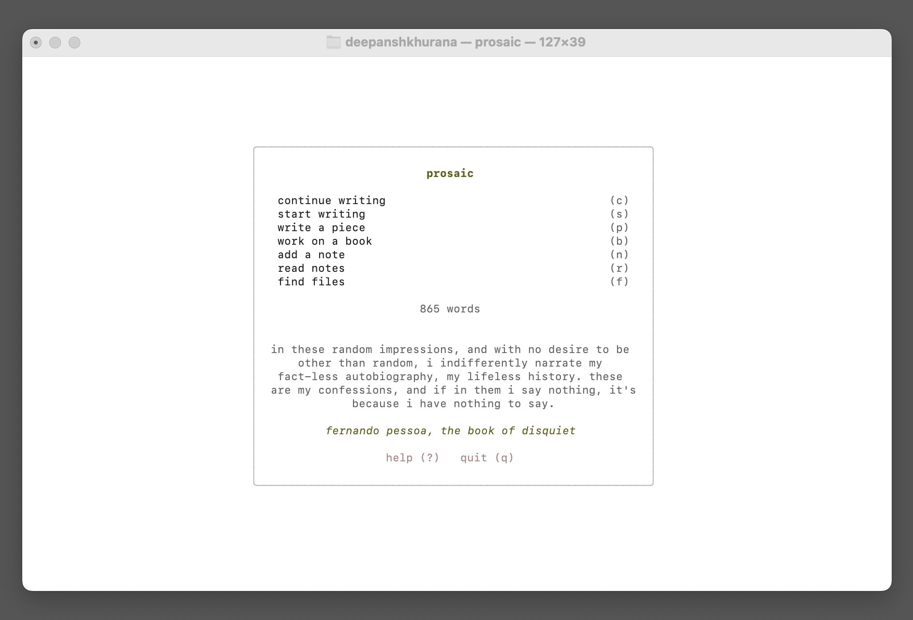
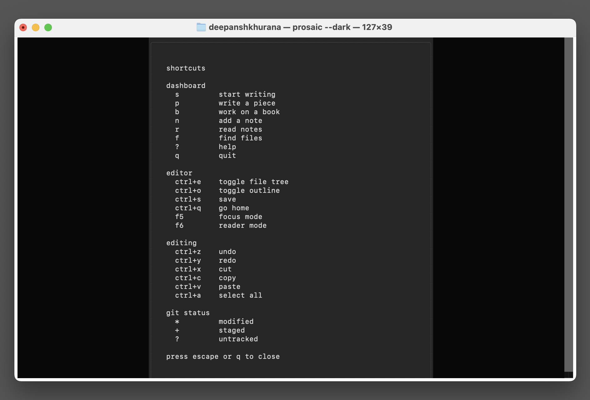
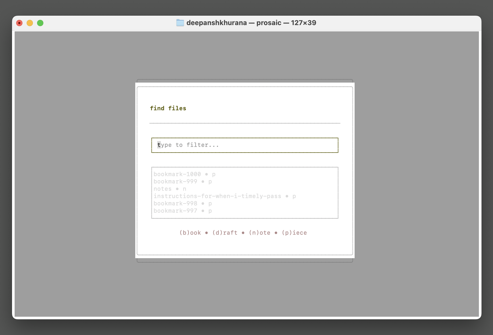
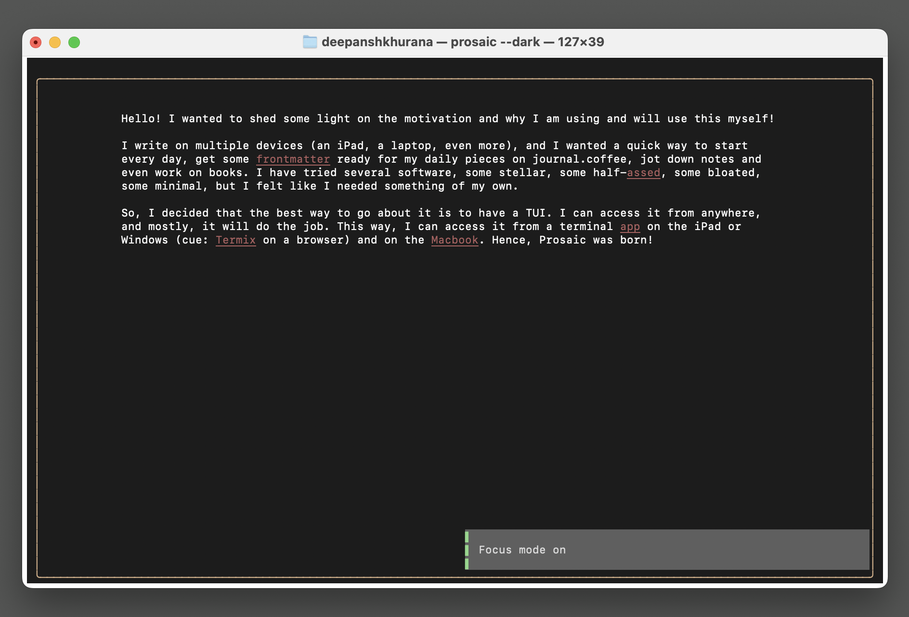
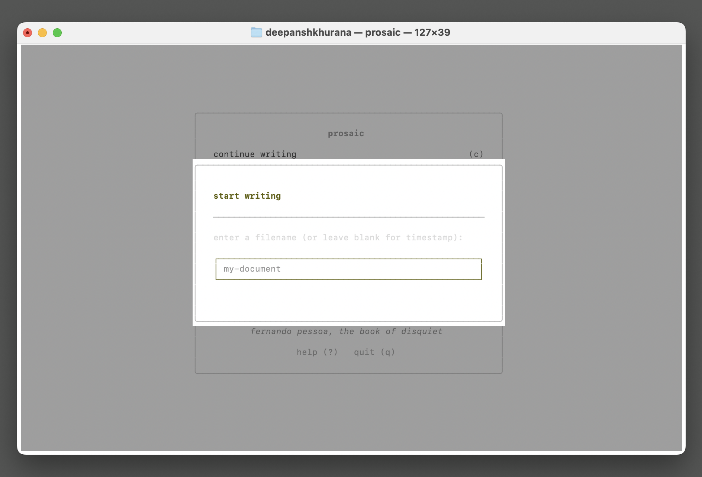
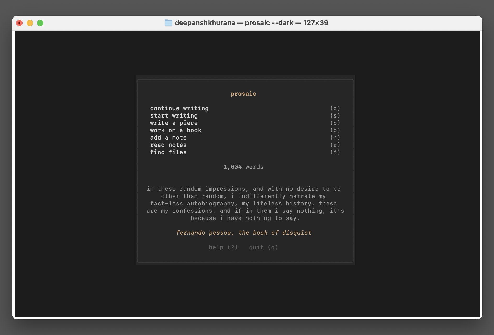

# Prosaic

[](https://candor.md)
[](https://github.com/DeepanshKhurana/Prosaic/actions/workflows/ci.yml)
[](https://opensource.org/licenses/MIT)

A writer-first terminal writing app built with Python and Textual, built with the assistance of LLM/Copilot tools.

[Landing page](https://prosaic.dimwit.me)

## Motivation

I write on multiple devices (an iPad, a laptop, even more), and I wanted a quick way to start every day, get some frontmatter ready for my daily pieces on [journal.coffee](https://journal.coffee), jot down notes and even work on books. I have tried several software, some stellar, some half-assed, some bloated, some minimal, but I felt like I needed something of my own.

So, I decided that the best way to go about it is to have a TUI. I can access it from anywhere, and mostly, it will do the job. This way, I can access it from a terminal app on the iPad or Windows (cue: Termix on a browser) and on the Macbook. Hence, Prosaic was born.

**Full disclosure:** I did rely on LLMs to make it, but as much as I could, I tried to get it to follow best practices, good architecture, and clean code principles.

## Publish with Ode

Looking somewhere to publish your writing that is philosophically compatible with Prosaic? Check out [Ode](https://ode.dimwit.me/). You can also go to the [GitHub](https://github.com/DeepanshKhurana/ode/) directly. 

> Ode is for writers who want to publish in an aesthetically pleasing website, ignoring the bells and whistles of the modern internet. It is opinionated, minimal, and easy to use, guided by an [Ethos](https://docs.ode.dimwit.me/ethos) that prioritizes the craft of writing and the joy of reading over metrics and engagement.

## Screenshots

| | |
|---|---|
|  |  |
|  |  |
|  |  |

## Installation

```bash
# Install (requires Python 3.11+)
pipx install prosaic-app

# Upgrade to latest version
pipx upgrade prosaic-app

# Run (first launch runs setup wizard)
prosaic

# Re-run setup wizard anytime
prosaic --setup
```

## Usage

```bash
prosaic [OPTIONS] [FILE]
```

| Option | Description |
|--------|-------------|
| `--light` | Use light theme (default) |
| `--dark` | Use dark theme |
| `--profile <name>` | Use a specific profile |
| `--profiles` | List all profiles |
| `--setup` | Run setup wizard again |
| `--reference` | Show reference |
| `--license` | Show MIT license |
| `--help` | Show help message |

Open a file directly:

```bash
prosaic ~/writing/draft.md
prosaic --dark ~/writing/draft.md
```

## Features

- **Markdown-first**: Live outline, word counting
- **Focus mode**: Hide everything except your writing
- **Reader mode**: Distraction-free reading
- **Start writing**: Quick writing session with all panes open
- **Continue writing**: Resume your last edited document
- **Daily metrics**: Track words and characters written each day
- **Profiles**: Separate workspaces for different projects
- **Git-ready**: Archive is Git-initialized for versioning

## Profiles

Profiles let you maintain separate workspaces for different writing projects (personal, work, fiction, etc.).

```bash
# List profiles
prosaic --profiles

# Use a specific profile
prosaic --profile work

# Create a new profile (runs setup wizard)
prosaic --profile fiction
```

Each profile has its own:
- Archive directory
- Git remote (optional)
- Theme preference

Manage profiles from the dashboard menu (`m` key) or edit in `~/.config/prosaic/settings.json`.

**Upgrading from v1.1.1 or older?** Your existing setup is automatically preserved as the "default" profile. On first launch after upgrading, you'll be offered the option to set up additional profiles or rename your default.

## Books

Books are long-form writing projects stored as directories in your archive's `books/` folder.

```
my-book/
  chapters/               Individual chapter files
    chapter-one.md
    chapter-two.md
  chapters.md             Chapter reading order (one filename per line)
  manuscript.md           Auto-generated compilation (read-only)
```

Working on a book:

1. Press `b` on the dashboard to open book selection
2. Select an existing book or create a new one
3. Select an existing chapter or create a new one
4. The manuscript auto-compiles on every save and when you leave a chapter
5. Press `m` in chapter selection to compile manually at any time

The manuscript is read-only in Prosaic — edit your chapters, not the manuscript directly.

**Upgrading from v1.3.4 or older?** Legacy books (single `.md` files) are automatically migrated to this structure on first open. Your original file is preserved with a `.bak` extension.

## Keybindings

| Category | Key | Action |
|----------|-----|--------|
| Dashboard | `s` | Start writing (quick session) |
| Dashboard | `c` | Continue writing (if last file exists) |
| Dashboard | `p` | Write a piece |
| Dashboard | `b` | Work on a book |
| Dashboard | `n` | Add a note |
| Dashboard | `r` | Read notes |
| Dashboard | `f` | Find files |
| Dashboard | `?` | Help |
| Dashboard | `m` | Manage profile |
| Dashboard | `q` | Quit |
| Editor | `Ctrl+e` | Toggle file tree |
| Editor | `Ctrl+o` | Toggle outline |
| Editor | `Ctrl+p` | Key palette |
| Editor | `Ctrl+s` | Save |
| Editor | `Ctrl+m` | Compile manuscript (books only) |
| Editor | `Ctrl+q` | Go home |
| Editor | `F1` | Help |
| Editor | `F5` | Focus mode |
| Editor | `F6` | Reader mode |
| Writing | `Ctrl+z` | Undo |
| Writing | `Ctrl+y` | Redo |
| Writing | `Ctrl+x` | Cut |
| Writing | `Ctrl+c` | Copy |
| Writing | `Ctrl+v` | Paste |
| Writing | `Ctrl+a` | Select all |
| Writing | `Ctrl+k` | Toggle markdown comment |

## Pane Defaults

| Mode | Tree | Outline |
|------|------|---------|  
| write a piece (default) | shown | hidden |
| start writing | shown | shown |
| add a note | hidden | shown |
| read notes | hidden | shown |
| work on a book | hidden | shown |
| focus mode | hidden | hidden |
| reader mode | hidden | hidden |

## Themes

- **Prosaic Light** (default): Warm white background with brick accents
- **Prosaic Dark**: Deep charcoal with warm tan accents

```bash
# Light mode (default)
prosaic

# Dark mode
prosaic --dark
```

## Configuration

Config location (in order of priority):
1. `PROSAIC_CONFIG_DIR` env var (explicit override)
2. `$XDG_CONFIG_HOME/prosaic/` (Linux standard)
3. `~/.config/prosaic/` (default)

Override with environment variable:

```bash
PROSAIC_CONFIG_DIR=~/custom/path prosaic
```

### Git Integration

If your chosen archive directory already contains a git repository, the wizard will:

- Detect the existing `.git` directory
- Inherit the repository (no re-initialization)
- Read the remote URL if configured
- Prompt for a remote URL if none exists
- Store this info in `settings.json`

Example `settings.json`:

```json
{
  "app_version": "1.2.1",
  "setup_complete": true,
  "active_profile": "default",
  "profiles": {
    "default": {
      "archive_dir": "/Users/you/Prosaic",
      "init_git": true,
      "git_remote": "git@github.com:you/writing.git",
      "theme": "light",
      "last_file": "/Users/you/Prosaic/pieces/2026-03-03-example.md"
    }
  }
}
```

## Archive Structure

```
~/Prosaic/              # Default archive (configurable)
  pieces/               # Pieces with preloaded markdown frontmatter
  books/                # Long-form projects with Outline already open
  *.md                  # Drafts (loose files in root)
  notes.md              # Quick notes with auto date headers
  metrics.json          # Daily statistics for archival and display
  .git/                 # Version control
```

## License

MIT
